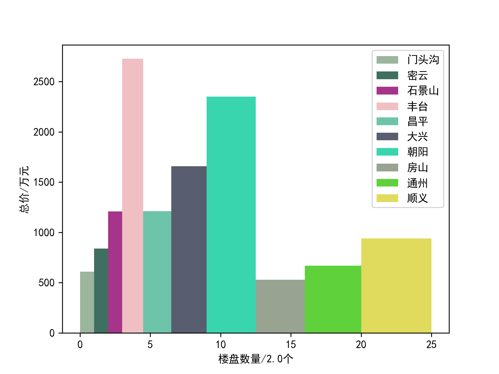
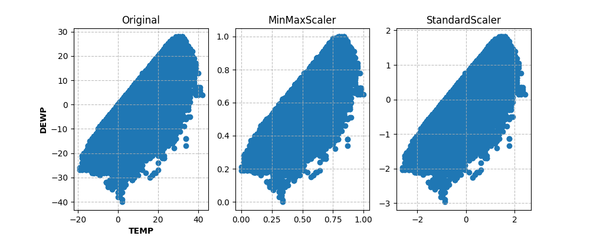

# BUPT Python Homework 2022

**北京邮电大学计算机学院 2022年秋 Python选修作业汇总**

### OJ作业
*共四次，具体题目已查询不到，仅保留了代码
1. 基本语法
2. 组合类型
3. 函数
4. 对象和文件

### 小作业
1. 爬虫  
    爬取链家官网新房和二手房的数据
    详见 `/Scrapy` 文件夹

2. 数据处理可视化1  
    可视化爬取数据，详见 `/DataProcess/Work1` 文件夹
    

3. 数据处理可视化2  
    可视化爬取数据，详见 `/DataProcess/Work2` 文件夹
    

### 期末大作业

**租房数据分析**

详见 `/Final`文件夹
具体要求与汇报结果见 `/Final/scripts` 文件夹

1. 抓取链家官网北上广深4个一线城市，再加上一个离你家乡最近的一个非一线城市/或者你最感兴趣的一个城市的数据。
2. 比较5个城市的总体房租情况，包含租金的均价、最高价、最低价、中位数等信息，单位面积租金（元/平米）的均价、最高价、最低价、中位数等信息。采用合适的图或表形式进行展示。
3. 计算和分析每个城市不同板块的均价情况，并采用合适的图或表形式进行展示。

/counts.jpg)
/orien.jpg)
/room.jpg)

